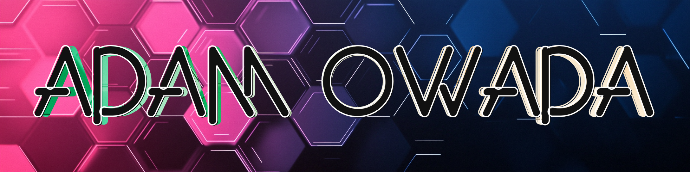

 
  
<h2>🤖 Cool Projects I've Worked On</h2>

  <!-- Repo info cards - https://github.com/anuraghazra/github-readme-stats -->
  <!-- Small repo cards (fork) - https://github.com/DenverCoder1/github-readme-stats -->
  

    
    
    
    
    
    
    
    
    
    
  

 
  
<h2>👋 About Me</h2>

  
I like building tools that help users be more efficient with their time. Lately I've been building apps utilizing GPT-4o, and OpenAI's Assistants API. My specialty is in full stack web development using Django and Next.js, and I have experience teaching web development to beginners, intermediates, and advanced developers alike. I'm also experienced in web scraping, API development, database engineering, TensorFlow, and the MERN stack.

  <h2>🧑‍💻 Fun Facts</h2>
    &nbsp;&nbsp;&nbsp;&nbsp;&nbsp;&nbsp;&nbsp;&nbsp;🐕 My dog Brock is bestest boy 
    &nbsp;&nbsp;&nbsp;&nbsp;&nbsp;&nbsp;&nbsp;&nbsp;🌲 Recently went camping at Olympic National Park 
    &nbsp;&nbsp;&nbsp;&nbsp;&nbsp;&nbsp;&nbsp;&nbsp;📸 Portrait photographer rocking a Sony a6500 
    &nbsp;&nbsp;&nbsp;&nbsp;&nbsp;&nbsp;&nbsp;&nbsp;🏋️‍♂️ Competed in 4 men's physique bodybuilding competitions 
    &nbsp;&nbsp;&nbsp;&nbsp;&nbsp;&nbsp;&nbsp;&nbsp;☕ Coffee is life! 
    &nbsp;&nbsp;&nbsp;&nbsp;&nbsp;&nbsp;&nbsp;&nbsp;🎤 Retired wedding DJ/MC with over 10 years of experience 

  
<h2>🎥 My YouTube Channel</h2>

  <h4>Check out my latest video</h4>

  

  
<h2>🖼️ Featured Image</h2>

  <h4>Brock at the beach!</h4>

    

